## 18.08.2007.
### Grupa 1

1. Ucitati celobrojne nizove P duzine N i Q duzine M. Odstampati ucitane podatke.
2. Odrediti i odstampati najmanji element niza Q koji je veci od najveceg elementa niza P.
3. Formirati niz duzine R duzine 2K gde je K = min(M, N) od elemenata nizova P i Q u sledecem redosledu:
Pk, Pk-1, Q2, Q1, Pk-2, Pk-3, Q4, Q3..., P2, P1, Qk, Qk-1. Smatrati da je K paran broj.
4. Sortirati niz Q tako da se u nizu Q prvo nalaze celi, a zatim ostali elementi. **Problem resiti bez uvodjenja novih elemenata.**
5. Ucitati matricu R reda M. Odrediti redni broj vrste matrice R koja sadrzi najveci broj istih vrednosti kao i niz Q.

### Grupa 2

1. Napisati potprogram koji na izlazu daje 1 ako je srednja vrednost elemenata ispod glavne dijagonale 
kvadratne matrice A reda N veca od minimalne vrednosti u prvoj koloni, u suprotnom 0.
2. Napisati potprogram koji zadatu kvadratnu matricu A reda N i nis B duzine K formira niz C koji predstavlja presek
niza B i skupa elemenata koji se nalaze na neparnim pozicijama u matrici A(Aq je na neparnoj poziciji ako je i+j 
neparan broj j).
3. Napisati glavni program kojim se ucitava kvadratna matrica A reda N i niz T duzine M. Izracunati matricu C prema 
sledecoj formuli:

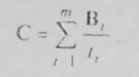

  gde je B1 = A/1 ako je matrica t1 A takva da je srednja vrednost elemenata ispod glavne dijagonale veca od minimalnog
  elementa u njenoj prvoj koloni ina;e je B1 = i * A (koristiti potprogram iz prve tacke). Za matricu C i niz T pozvati
  potprogram iz druge tacke i odstampati njegov rezultat.
  
### Grupa 3

1. Napisati potprogram kojim se pronalazi najveci element matrice A dimenzije MxN.
2. Napisati potprogram kojim se za zadatu kvadratnu matricu A reda N formira matrica B takva da je element B1 jednak zbiru svih elemenata matrice A koji pripadaju kvadratu 3x3 sa centrom u (i, j).
3. Napisati glavni program kojim se ucitavaju brojevi M i N i niz duzine M kvadratnih matrica reda N. Pronaci matricu P iz niza ciji je najveci element dobijen potprogramom pod 1) najmanji. Koriscenjem potprograma pod 2) od matrice P formirati matricu Q. Odstampati ulazne podatke i matricu Q.

### Grupa 4

1. Ucitati celobrojne nizove A duzine M i B duzine N. Odstampati ucitane podatke.
2. Odrediti i odstampati broj elemenata niza A ciji je kvadratni koren ceo broj, a veci su od srednje vrednosti elemenata niza B.
3. Formirati i odstmapati matricu C prema sledecoj semi.

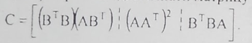

4. Odrediti i odstmapati najvecu vrednost u nizu B cija je najmanja cifra broj deljiv brojev 3. 
5. Transformisati niz A tako da u njemu budu najveci od svih elemenata iz oba niza. Problem resiti bez uvodjenja novih nizova.

### Grupa 5 

1. Napisati potprogram kojim se pronalazi drugi po velicini element matrice A dimenzija MxN.
2. Napisati potprogram kojim se za zadatu kvadratnu matricu A reda N formira matrica B takva da je element Bq jednak zbiru elemenata matrice A koji pripadaju i-toj vrsti i j-toj koloni matrice, a nisu veci od elemenata Aq.
3. Napisati glavni program kojim se ucitavaju brojevi M i N i kvadratna  matrica A reda N. Koriscenjem potprograma pod 2) od 
matrice A formirati matricu B. Odstampati ulazne podatke i matricu B. Izracunati zbir 

  i za matricu C izracunati i odstampati drugi element po velicini.
  
## 12.06.2007.
### Grupa 1

1. Ucitati kvadratnu matricu C reda M. Odstampati ucitane podatke.
2. Formirati i odstampati niz D prema sledecem pravilu: i-ti element niza D jednak je najvecoj vrednosti u i-toj koloni matrice C koja je pun kvadrat.
3. Formirati i odstampati matricu A prema sledecoj semi:

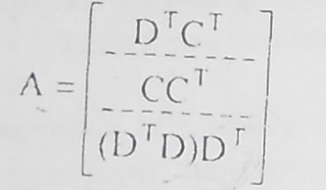

4. Odrediti i odstampati vrstu matrice C sa najmanjim brojem elemenata koji u dekadnom zapisu nemaju parnu cifru.
5. Transformisati matricu C promenom redosleda kolona tako da elementi glavne dijagonale transformisane matrice budu sortirani u rastuci redosled.

### Grupa 2

1. Napisati potprogram kojim se pronalazi prost delilac koji je najblizi korenu zadatog broja.
2. Napisati potprogram kojim se pronalazi elemenat niza koji ima najvise razlicitih delilacaa.
3. Ucitati celobrojni niz Y duzine N. Formirati niz X tako sto se njegov i-ti element dobija pozivom potprograma pod 1) za Y(i). Odrediti broj Z pozivom potprograma pod b) za niz Y. Formirati i odstampati matricu:

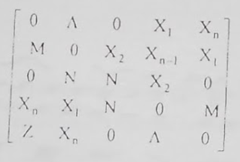

### Grupa 3

1. Ucitati celobrojnu kvadratnu matricu C reda M. Odstampati ucitane podatke.
2. Formirati i odstampati niz D prema sledecem pravilu: i-ti element niza D jednak je najmanjoj vrednost u i-toj vrsti matrice C koja je deljiva brojem 3.
3. Formirati i odstampati matricu A prema sledecoj semi:

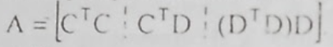

4. Odrediti i odstampati kolonu matrice C sa najvecim brojem elemenata koji u dekadnom zapisu imaju 0.
5. Transformisati matricu C promenom redosleda vrste tako da elementi sporedne dijagonale transformisane matrice budu sortirani u opadajuci redosled.

### Grupa 4

1. Napisati potprogram kojim se pronalazi slozen delilac zadatog broja. 
2. Napisati potprogram kojim se pronalazi elemenat niza koji ima koren najviseg reda koji je ceo broj (npr. u nizu 17, 27, 13, 64, 125, to je 64 = 26)
3. Ucitati celobrojni niz Y duzine N. Formirati niz X tako sto se njegov i-ti element dobija pozivom potprogramapod 1) za Y(i). Odrediti broj Z pozivom potprograma pod 2) za niz Y. Formirati i odstmapati matricu:

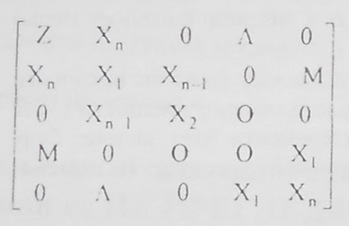

## 03.09.2007.
### Grupa 1

1. Ucitati broj N, niz X duzine N i kvadratnu matricu A reda N. Odstampati ucitane podatke.
2. Izracunati crednju elemenata niza koji su najveci od srednje vrednosti vrednosti celog niza.
3. Neka je Y=XtXAtX. Formirati matricu:

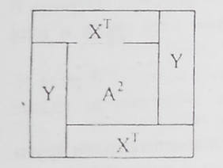

4. Formirati niz Z tako sto se u svakoj dijagonali matrice A paralelnoj sporednoj pronalazi najmanji elemenat.
5. Preurediti redosled elemenata niza X tako da svaki naredni element ima ne manje cifara od prethodnog. Odstampati komentar ukoliko to nije moguce.

### Grupa 2

1. Napisati potprogram za mnozenje matrica A dimenzija MxK i B dimenzija KxN.
2. Napisati potprogram koji za zadatu kvadratnu matricu A reda n racuna zbir svih clanova matrice koji se nalaze na sivim pozicijama sa slike (kao sahovska tabla), a koji su ujedno i celi brojevi.

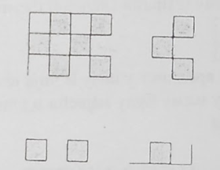

3. Napisati glavni program kojim se ucitava prirodan broj n i kvadratna matrica A reda n. Izracunati i odstampati matricu C prema sledecoj formuli:

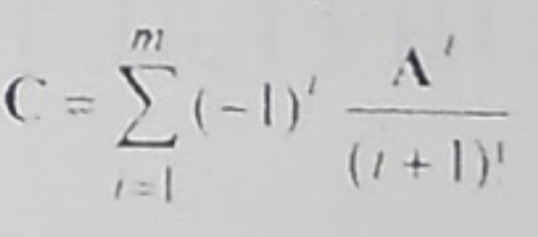

## 16.01.2007.
### Grupa 1

1. Ucitati kvadratnu matricu A reda M i niz P duzine M. Odstampati ucitane podatke.
2. Odrediti i odstampati polozaj i vrednost najmanjeg pozitivnog elementa matrica A.
3. Odrediti i odstampati matricu B prema sledecoj formuli:

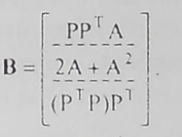

4. Formirati niz Q od onih elemenata matrice A koji se u matrici pojavljuju paran broj puta.
5. U matricu A dodati (M+1) kolonu ciji elementi predstavljaju prosecne vrednosti odgovarajucih vrsta matrice A. Zameniti
vrste matrice A tako da elementi M+1 kolone budu sortirani u opadajuci raspored. Odstampati transformisanu matricu. 
**Napomena: zadatak resiti bez uvodjenja pomocnih matrica.**

### Grupa 2

1. Napisati potprogram koji za zadati razlomljeni broj izracunava ceo broj ciji je dekadni zapis isti kao dekadni zapis 
razlomljenog dela zadatog broja.
2. Napisati potprogram koji medju elementima zadatog niza pronalazi najveci koji je manji od svog razlomljenog dela, kada se on posmatra kao ceo broj.
3. Napisati glavni program kojim se ucitavaju nizovi X i Y duzine N. Neka je Q vrednost koja se dobija pozivom potprograma pod 2, za niz X. Izracunati srednju vrednost elemenata niza Y takvih da su veci od celog dela broja Q, a manji od njegovog razlomljenog dela, kada se on posmatra kao ceo broj.

## 31.03.2005.
### Grupa 1

1. Ucitati niz A duzine M i kvadratnu matricu B reda M. odstmapati ucitane podatke. 
2. Odrediti i odstampati vrednost onog elementa niza A koji se najvise razlike od elementa B(M.M).
3. Za svaku kolonu matrice B odrediti broj elemenata koji se javljaju u nizu A. **Napomena**: Svaka kolona matrice B moze da sadrzi elemente koji se ponavljaju.
4. Odstampati one elemente niza A ciji je ceo deo zapisan istim ciframa kao i razlomljeni deo.
5. Formirati i odstampati matricu C po sledecem pravilu: element C(i,j) jednak je zbiru elemenata matrice B koji ne pripadaju levoj i desnoj dijagonali elementa B(i,j).

### Grupa 2 

1. Napisati potprogram za resavanje jednacine F(x)=G(x)2, gde su F i G zadate funkcije. Problem resiti primenom Newton-ovog metoda, sa pocetom iteracijom X0 dozvoljenim brojem iteracija M i tacnoscu EPS. Prvi izvodi funkcija F i G su zadati potprogramima DF i DG.
2. Napisati potprograme za izracunavanje funkcija:

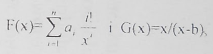
  
  i G(x)=x/(x-b) (b je konstanta) kao i njihovih prvih izvoda DF i DG.
3. Napisati glavni program kojim se ucitavaju brojevi X0, EPS, M, N i nizovi A i B duzine N. Nizom A definisana je funkcija F opisana pod 2). Resiti sve jednacine F(x)=x/(x-B(i)) pozivom potprograma pod a), sa dozvoljenim brojem iteracija M, tacnoscu EPS i pocetnom iteracijom X0. Resavanje sprovesti samo ako je prekid funkcije G(x)=x/(x-B(i)) nije u EPS okolini pocetne iteracije. Medju resenjima dobijenim sa trazenom tacnoscu odrediti ono za koje je odstupanje F(x)-G(x)2 najmanje po apsolutnoj vrednosti.

## 04.04.2007
### Grupa 1

1. Sastaviti potprogram za izracunavanje sledece funkcije 

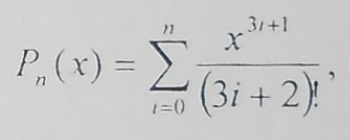

gde je n zadati broj.
2. Sastaviti potprogram za resavanje jednacine PN(X)+PK(X) = w, za zadate brojeve N i K, metodom Regula falsi sa tacnoscu EPS i dozvoljenim brojem iteracije M, ako je P polinom definisan pod 1). Resenje se nalazi u segmentu [A,B].
3. Sastaviti glavni program kojim se ucitavaju brojevi M, N, L, EPS, K i matrica A sa K vrsta i tri kolone. Za svaku vrstu matrice A izracunati resenje jednacine PN(X) - PL(X)= A(I,1) metodom Regula falsi na segmentu [A(1,2),A(I,3)], sa tacnoscu EPS i dozvoljenim brojem iteracija M, gde je P polinom definisan pod 1). Prethodno proveriti postojanje nule u zadatom segmentu. Medju izracunatim resenjima pronaci ono cije je odstupanje PN(X) - PL(X) - A(I,1) najmanje.

### Grupa 2

1. Ucitati kvadratnu matricu A reda M i niz C duzine M. Odstampati ucitane podatke.
2. Odrediti i odstampati vrednost kvadratne forme CTAC.
3. Formirati i odstmapati niz V ciji je i-ti element jednak apsolutnoj razlici dve najmanje vrednosti u i-toj vrsti matrice A.
4. Odrediti i odstampati prvi pronadjeni par vrednosti K i L prema sledecem postupku: ako je K-ti element niza C negativan tada u K-toj vrsti matrice A odrediti polozaj L najmanje negativne vrednosti, ako posotoji. **Napomena: Smatrati da se vrednosti K i L sigurno mogu odrediti**.
5. Transformisati i odstampati matricu A prema sledecim formulama:

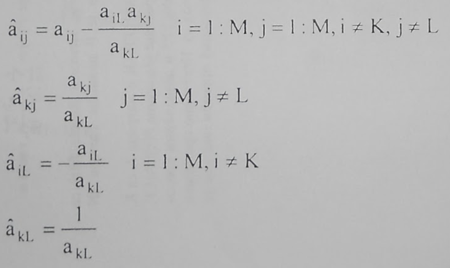

